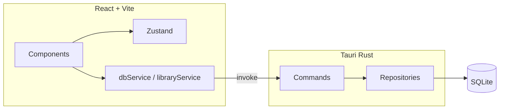

# Readito

> **Early development** — This project is in active development and still in its early stages. Features may change, bugs are expected, and the API/UX is not stable yet. Feedback and contributions are welcome!

---

Open source desktop reader for EPUB, PDF, and image folders (manga/comics), with a focus on **offline-first** and full user control over their files.

Built with [Tauri](https://tauri.app/) (Rust) + [React](https://react.dev/) + [Vite](https://vitejs.dev/) + [TypeScript](https://www.typescriptlang.org/), the app runs **100% offline**, saves progress locally, and supports multiple reading modes (single page, dual page, continuous scroll, LTR/RTL), configurable per book.

## Support

If this project helps you, consider supporting its development:

[](https://ko-fi.com/pedroserodio)

## Philosophy

- **No monetization** — donations only
- **Lightweight** — small binary, minimal resource usage
- **Private** — your files stay on your computer
- **Extensible** — architecture ready for future enhancements

## Features

### Reading

- **Supported formats** — EPUB, PDF, JPG, PNG, WebP
- **Reading modes** — single page, dual page, continuous scroll
- **Direction** — LTR and RTL configurable per book
- **Presets** — Book, Manga, Comic, PDF
- **Dual page** — spine shadow effect in the center of the spread
- **Fullscreen** — cinema mode with prev/next buttons; sidebar toggle in TopBar
- **Bottom controls** — auto-hide with delay for distraction-free reading

### Library

- **Add content** — folders or individual files from your machine
- **Open from file** — open EPUB, PDF, CBZ, CBR via system file association
- **Book cards** — progress bar, metadata preview; context menu on right-click
- **Book detail** — ficha do livro with cover, author, description; actions: Edit, Mark completed, Reset progress, Remove
- **Metadata search** — fetch metadata from Open Library, LoC, AniList, Kitsu, Jikan
- **Book editing** — title, author, description, cover image
- **Remove book** — confirmation modal before deletion
- **Shelves** — organize books into custom collections

### Settings

- **Tabs** — General, Library, Shortcuts, About
- **Theme** — Light, Dark, System (follows OS), or custom CSS themes
- **Keyboard shortcuts table** — reference for all atalhos

### Keyboard shortcuts

- **Home** / **End** — first / last page
- **G** — go to page (modal)
- **Arrow keys** — previous / next page
- Plus all settings/configurable shortcuts

### Internationalization

- Portuguese (Brazil), English, Spanish

## Roadmap

The architecture is already prepared for:

- **Optional sync** — Go API with Last Write Wins strategy
- **Google login** and Google Drive backup
- **React Native app** — reading on mobile devices
- **Book identification** — SHA-256 hash for deduplication and sync

## Architecture

### Overview



### Directory structure

| Directory | Description |
| --------- | ----------- |
| `src/components/` | UI by domain: layout, library, reader, settings |
| `src/reader/adapters/` | Format-specific adapters (EPUB, PDF, Image, Archive) |
| `src/store/` | Global state (Zustand): readerStore, presets |
| `src/services/` | dbService (Tauri invoke), libraryService (scan/import) |
| `src-tauri/src/commands/` | Tauri commands exposed to the frontend |
| `src-tauri/src/repositories/` | Data access layer (book, progress, settings, shelf) |
| `src-tauri/src/db/` | SQLite schema and migrations |

### Reader adapter pattern

- **AdapterFactory** creates the correct adapter by format (pdf, epub, image, cbz, rar).
- **BaseAdapter** handles page cache, pre-render, and aspect ratio.
- Subclasses implement `load()`, `renderPage()`, and `destroy()`.
- **ArchiveAdapter** extends ImageAdapter; uses native extraction (CBZ/ZIP) or 7-Zip (RAR).

Key files: [`src/reader/adapters/AdapterFactory.ts`](src/reader/adapters/AdapterFactory.ts), [`src/reader/adapters/BaseAdapter.ts`](src/reader/adapters/BaseAdapter.ts)

### Data flow

- **Frontend → Backend**: `dbService` uses `invoke()` to call commands (`add_book`, `save_progress`, etc.).
- **State**: `readerStore` (Zustand) holds reader settings and status (empty/loading/ready/error).
- **Progress**: saved with debounce (~1.2s) in `ReaderLayout`.

Key files: [`src/services/dbService.ts`](src/services/dbService.ts), [`src/store/readerStore.ts`](src/store/readerStore.ts)

### Persistence layer (Rust)

- **Repositories** separate data logic from Tauri commands.
- Main tables: `books`, `volumes`, `chapters`, `reading_progress`, `book_settings`, `global_settings`, `shelves`, `book_shelves`.

Key file: [`src-tauri/src/db/schema.rs`](src-tauri/src/db/schema.rs)

### Provider + Context

- `ReaderAdapterProvider` wraps the app and exposes `useReaderAdapter()` (loadPaths, renderToContainer, navigation).
- Allows switching formats without refactoring reading components.

Key file: [`src/reader/ReaderAdapterProvider.tsx`](src/reader/ReaderAdapterProvider.tsx)

## Development

### Prerequisites

- [Node.js](https://nodejs.org/) (LTS)
- [Rust](https://www.rust-lang.org/)
- [Tauri prerequisites](https://tauri.app/v2/guides/getting-started/prerequisites) for your platform

### 7-Zip (optional, for RAR support)

The app uses 7-Zip command-line to extract RAR files. **CBZ/ZIP** work without 7-Zip (extraction is done in code). Only **RAR** requires 7-Zip.

To enable RAR support:

1. Download the 7-Zip **installer** (not the Extra package):  
   https://www.7-zip.org/download.html  
   → e.g. **7-Zip 25.01 (64-bit)** — `.exe` file

2. Install 7-Zip.

3. Copy to `src-tauri/resources/7z/`:
   - `C:\Program Files\7-Zip\7z.exe`
   - `C:\Program Files\7-Zip\7z.dll`

4. You can uninstall 7-Zip afterwards; the files stay bundled in the app.

Final structure in `src-tauri/resources/7z/`:

```
├── README.md
├── 7z.exe      ← required for RAR
├── 7z.dll      ← required for RAR
├── 7za.exe     (optional; supports 7z, ZIP — not RAR)
└── 7za.dll
```

7-Zip is under GNU LGPL. See details in `src-tauri/resources/7z/README.md`.

### Commands

```bash
# Install dependencies
npm install

# Run in development mode
npm run tauri dev

# Build for production
npm run tauri build
```

The executable will be generated in `src-tauri/target/release/`.

## Tech Stack

| Area     | Stack                   |
| -------- | ----------------------- |
| Desktop  | Tauri 2 (Rust)          |
| Frontend | React 19, Vite 7, TypeScript |
| Styling  | Tailwind CSS 4          |
| State    | Zustand                 |
| EPUB     | epub.js                 |
| PDF      | PDF.js (Mozilla)        |
| i18n     | i18next                 |

## License

MIT License — see [LICENSE](LICENSE). The project is open source and welcomes contributions.
